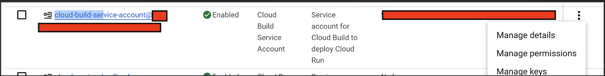

### *Prerequisites*

**Summary**: Have `uv` installed, create an empty repo in the WCK organization, create a GitHub PAT, download a JSON key for our Cloud Build Service Account, and save the keys in a secure place. 

Be prepared to provide the PAT, the path to your .json, and the github repo url during the CLI setup. 

---

### Checklist 

Tasks which you as an individual WCK developer need to complete are marked with `- [ ]`, vs. ✅ for what I (Alex Socarras) did already. 

**Local Setup**:

- ✅ Install [Git](https://www.google.com/search?client=firefox-b-1-d&q=git+install)
    - This should be included on MacOS
    - I recommend you configure [SSH](https://docs.github.com/en/authentication/connecting-to-github-with-ssh) for better security (optional)
- [ ] Install [uv](https://docs.astral.sh/uv/getting-started/installation/)

**Cloud Services**: 

- [ ] Create an empty GitHub repository in the WCK Organization for your new project.

* ✅ Install the [Google Cloud Build GitHub App](https://github.com/marketplace/google-cloud-build) and connect it to your repository.   
    - ✅  Save the installation ID of the cloud build app: go to `https://github.com/settings/installations`, click on `Configure` for the Cloud Build app, and copy the integer added to the url  ~~(you will need to provide this parameter when prompted in the CLI)~~

        * I set up the Cloud Build App for the entire WCK organization on all repositories and put the installation ID in the setup script's default parameters.

- [ ] Create a GitHub [personal access token](https://docs.github.com/en/authentication/keeping-your-account-and-data-secure/managing-your-personal-access-tokens) (classic)    

    

    Profile Pic > Settings > Developer Settings > Personal Access Tokens > Tokens (Classic)

    Set the following permissions 
    * `repo`
    * `read:org`
    * `read:user`

    Save this token in 1Password or on your personal machine (see **Securing Keys**)
   
    ***NOTE***: Your work account may need to be an admin or owner of the WCK GitHub organization, before you can create a PAT with the necessary permissions on repos owned by the organization account.

* ✅ Create a GCP Service Account with the following IAM roles
    * `Artifact Registry Writer` 
    * `Cloud Build Editor` 
    * `Cloud Run Admin` 
    * `Cloud Run Invoker` 
    * `Secret Manager Admin` 
    * `Storage Object Creator` 

    * I gave the Secret Manager Admin and Storage Object Creater IAM roles to the default Cloud Build Service Account.

- [ ] Create and download a .json key for the service account. Store the .json in a secure folder on your machine (see **Securing Keys**)
 

    Cloud Console > Service Accounts > `cloud-build-service-account` > Manage 
    Keys > Add Key > JSON

--- 

**Securing Keys**: 

You can store a PAT on MacOS in a secure keychain: 

```bash
security add-generic-password -a "<GitHub-username>" -s "GitHub-PAT" -w "<your-pat>"

# set env var 
export GITHUB_TOKEN=$(security find-generic-password -a "<GitHub-username>" -s "GitHub-PAT" -w)

# View  the token 
echo $GITHUB_TOKEN
```

Or encrypt in a file w/ user-access locked

```bash 
echo "your-github-pat" | gpg --encrypt --recipient "your-email@example.com" -o github-pat.gpg
export GITHUB_TOKEN=$(gpg --decrypt github-pat.gpg) 
chmod 600 github-pat.enc github-pat.gpg # lock to current MacOS user 
```

Use the encrypted file approach for the cloud build service account .json file.